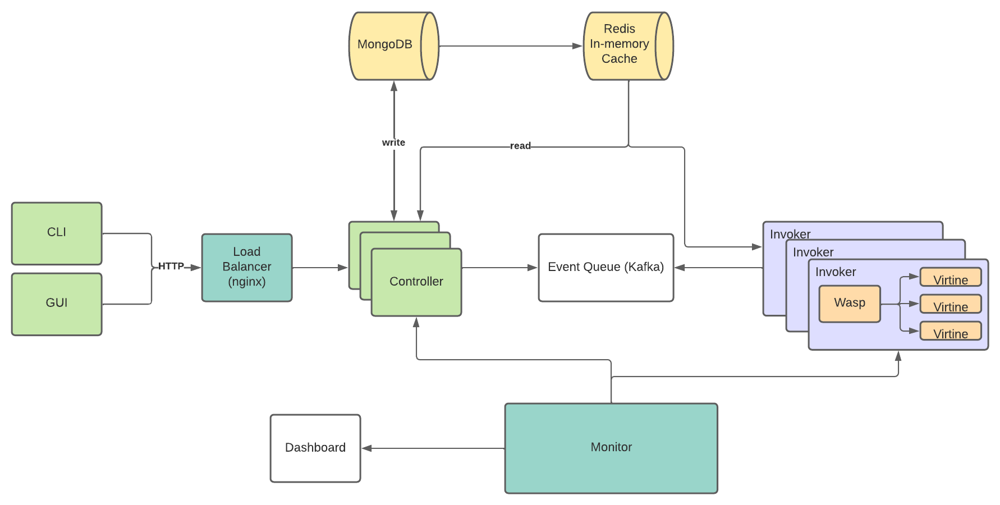
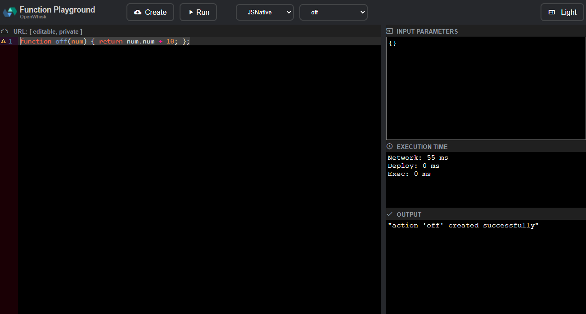

# Vespid

## Vespid

A Serverless Platform to interface with Virtines. In this platform, users can register Javascript and C functions, which produces requests to Virtines endpoint. These requests are handled by a concurrent server which runs each serverless function in a distinct virtine (rather than a container) by leveraging the Wasp runtime API. 

The system is inspired from open-source FaaS platform [OpenWhisk](https://github.com/apache/openwhisk). The system components are as follows:



There is also a standalone tool available to test out Vespid which starts up a UI (taken from openwhisk). Steps to install and use are mentioned in the section [Installation-steps](##Installation-steps-(standalone):)


## Available functions:

### Actions:
- [x] create
- [x] get
- [x] delete
- [x] invoke
- [x] list
- [ ] update

### Moitoring/Telemetry:
- [ ] CPU usage
- [ ] Memory usage
- [ ] Execution time
- [ ] Active instances
- [ ] Hits and misses
- [ ] Cold start Latency

### Load Testing:
- [x] workload generator using locust

### Logging:
- [x] invocations
- [x] cache hits and misses
- [ ] working on 

### Trigger:
- RESTFUL calls using noth GUI and CLI


## Installation steps (standalone):

### Prerequisites 

The following packages are necessary to get Wasp running:
- Install [Wasp](https://github.com/virtines/wasp)
- Checkout to js branch and follow the required steps
- Also, run the command: 
	```bash
	make js
	```


### Building and Installing

- clone vespid and install requirements
	```bash
	git clone git@github.com:sblayush/vespid.git
	pip3 install -r requirements.txt
	```
- copy and update config/appConfig.ex.dat to config/appConfig.dat with the required values, example number of workers, db_urls. For example:
  ```json
	{
		"port": 8989,
		"host": "0.0.0.0",
		"platform": "PROD",
		"reload": false,
		"n_workers": 2,
		"mongo_url": "mongodb://<ip>:<port>/"
	}
	```
- copy and update config/paths.ex.py to config/paths.py with the required values. For example:
  ```python
	wasp_shared_ob_path = "/home/<user>/wasp/build/libwasp.so"
	wasp_js_shared_ob_path = "/home/<user>/wasp/build/libwasp_js_x.so"
	js_exec_path = "/home/<user>/wasp/build/test/js"
	db_type = ""
	db_file_path = ""
  ```
- expose port (8989 by default)
	```bash
	sudo ufw allow <port>/tcp
	```


## Running

Steps to start the Server:
```bash
cd vespid
python3 core/standalone/api/app.py
```

To view webpage:
```<host_ip>:8989/```

To view swagger documentation:
```<host_ip>:8989/docs```


## TODO
- [ ] Kafka Queue
- [x] Redis in-memory database
- [ ] Authentication + session
- [ ] CLI executible
- [ ] Testing
- [ ] Monitoring + Dashboard
- [ ] Error Handling
- [ ] Better Logging
- [ ] Deployment using Docker
- [ ] Better steps to deploy standalone
- [ ] Trigger using events other than HTTP

## *Notes

- By default running on port 8989
- Still under development

### Resources

- https://orange.hosting.lsoft.com/trk/clickp?ref=znwrbbrs9_6-2d8c7x32fbcax0670&doi=3492321.3519553
- https://apt.llvm.org/
- https://github.com/apache/openwhisk
